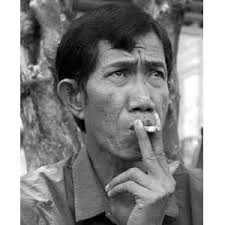

.. //Ethan Woodruff//

Ahmad Suradji
-------------

  
Ahmad Suradji is a serial killer from Indonesia. He killed 42 women between the 
ages of 17 and 40 from 1986 to 1997. When Ahmad Suradji killed a woman he would 
stranglethem her bury the body up to the waist into the ground. Afterwars,
he would then perform
a self-strengthening ritual in front of the body. He would bury these bodies is 
a field near his house and havethe bodies face towards his house. He was 
eventually arrested when someone left their daughter to be watched by the Ahmad 
and when they returned three days later the daughter was missing. People 
eventually found her body in a field during a search party in 1997. After he was 
arrested, him and his wife, who was an accomplice were both sentenced to death. 
Ahmad Suradji was executed in 2008 and his wife is still waiting for her death.  

Quick Facts
~~~~~~~~~~~

*  Ahmad Suradji claims he learned that it okay to kill people from his father. 
*  He also claimed that after his father’s death, his father’s spirit told him 
   to kill 70 women and point their bodies to his house so he would never die. 
