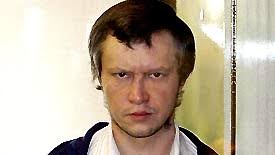

.. //Ethan Woodruff//
Alexander Pichushkin
====================

Alexander Pichushkin, also known as the Chessboard Killer and the Bitsa Park maniac, is a well-known Russian serial killer. He was an active serial killer from 1992 to June of 2006. It is believed that he killed 60 people in the southwest area of Moscow, Russia. His motive for killing people is believed to be that he wanted to be the best serial killer in Moscow. Previous to Alexander Pichushkin, the serial killer with the most murders was Andrei Chikatilo with 53. Also Alexander Pichushkin was obsessed with chess so he wanted to kill one person for each square on a chessboard. So Alexander Pichushkin’s goal was to kill more than 64 people. Unluckily for Alexander Pichushkin, he was caught just four murders away from his goal. 

Quick Facts
~~~~~~~~~~~

<<<<<<< HEAD
  *Alexander Pichushkin mostly killed homeless men after he got them drunk with vodka. 

  *He received the name the Bitsa Killer when people kept finding bodies in Bitsa Park. 

  *His signature way of killing a person was 64 hammer blows to the head. Then sticking a vodka bottle into their head or throat. 

  *The only other way he killed a person was by throwing them into an overflowing sewer after getting them drunk. 
=======
* Alexander Pichushkin mostly killed homeless men after he got them drunk with vodka. 

* He received the name the Bitsa Killer when people kept finding bodies in Bitsa Park. 

* His signature way of killing a person was 64 hammer blows to the head. Then sticking a vodka bottle into their head or throat. 

* The only other way he killed a person was by throwing them into an overflowing sewer after getting them drunk. 
<<<<<<< HEAD
=======
>>>>>>> b4a0d5127e8e0b660f8f0748fb9cd92a496a5d1a

>>>>>>> 60302ec8437463e87e0a683ff08c51d454c86a98
