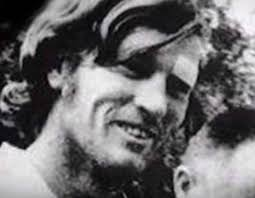

Casanova Killer
===============

General Information
~~~~~~~~~~~~~~~~~~~
Paul John Knowles also known as the Casanova Killer,. Knowles used his charm to 
seduce people and sadly make them his victims. He killed a total of 18 people, 
although the count might be more. In fact, he states that he killed many more, 
and we will never know.  His victims included men, women and children: so no 
real pattern to who he was going for next. The man from Florida was eventually 
killed by an FBI agent in 1974 when he was trying to escape. Only once did he 
attempt Necrophilia with one of his victims. He sexually assaulted 4 of his own 
18 victims. He also didn’t only stay in one state. He was actually killing 
people on a national scale for a short period time. His nickname came from the 
way he would use his charm to lure the people who he would later kill. Many 
people think that the rejection from his fiancé sparked the killings. Prior to 
killing many people, his fiancé rejected him. She rejected him because a Psychic
told her not to marry him. He was also given up for adoption as a child, which 
could have been the reason for his physiological problems.

=======================================================
Quick Facts
=======================================================
* He Escaped From Prison Before His Murder Spree Started
* One Of His Victims Was A Police Officer
* He Died During An Altercation With An FBI Officer
* Was born April 17, 1946, Orlando, FL

=======================================================

Here is a link to more info on the `Casanova Killer`_

.. _Casanova Killer: https://en.wikipedia.org/wiki/William_Bonin

Page Made by George