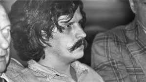

Freeway Killer!
===============

General Information
~~~~~~~~~~~~~~~~~~~
Bonin also known as the *‘Freeway Killer.'* Between 1979 and 1980, he raped,
tortured and murdered at least 21 young men. Bonin would dump their bodies along
freeways in South California. After being held guilty for 14 of his killings, he
was executed by lethal injection in 1996. His murderous side was seen when he 
was in prison. He would send letters to family and friends of the people that 
he would kill. Not only did we see this side in prison but also during his 
juvie time. Many people say his actions have to do with his horrible life at 
home. His grandfather was sexually abusive and his parents where alcoholics. 
His father was also physically and sexually abusive. Later in his life he 
was also sent to the orphanage where he was further abused physically and 
sexually. Essentially all his child life he was sexually and physically 
abused. After his time in juvie he began to show characteristics that where 
passed down from his family. He eventually served the country and fought in 
Vietnam, where he continued to show many of the behaviors shown to him as a 
child. He killed more than 21 boys in as little as one year.

=======================================================
Quick Facts
=======================================================
* Once described as he most **arch-evil person** who ever existed by prosecutor
* Age 10 Bonin was arrested for stealing vehicle license plates
* Named *Freeway Killer* due to the fact that the majority of his victims' 
	bodies were discovered alongside numerous freeways
* Was born January 8, 1947 Willimantic, Connecticut, United States

=======================================================

Here is a link to more info on the `Freeway Killer`_

.. _Freeway Killer: https://en.wikipedia.org/wiki/William_Bonin

Page Made by George