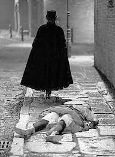

.. //Ethan Woodruff//
Jack the Ripper
===============

Jack the ripper was a notorious serial killer in the poor areas of London in the 1880s. Jack the Ripper mostly targeted prostitutes working in the poor areas of London. When he would find a victim he would cut their throats and remove all of their abdominal organs. Jack the Ripper received his name when he sent a letter attached to a human kidney to a local newspaper and signed it Jack the Ripper. After that letter was sent to the newspaper Jack the Ripper became a local celebrity because The initial story about him was able to make the newspaper a lot of money and all the media wanted in. 

Quick Facts
~~~~~~~~~~~

  * The Jack the Ripper was never caught *and could still be roaming the London streets*

  * Jack the Ripper was the first famous Ripper; someone who is excellent at killing with a knife. 
  * Jack the Ripper’s story has inspired many famous horror movies. One of the most famous being Dr. Jekyll and Mr. Hyde

  * The real identity of Jack the Ripper still has not been solved. For more information on the suspects visit `Jack the Ripper”_Suspects: https://en.wikipedia.org/wiki/Jack_the_Ripper_suspects

Suspects
~~~~~~~~

=================== ==============
Name                Job
=================== ==============
Montague Druitt     School-master
Seweryn Klosowski   Murder
Aaron Kosminski     Psychopath  
=================== ==============              
