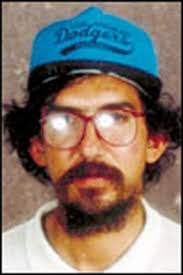

.. //Ethan Woodruff//

Luis Garavito
-----------------

Luis Garavito, also known as **The Beast** or **Goofy**, was the most infamous 
serial killer and rapist from Columbia. He mainly targeted poor, homeless or 
orphaned boys between the ages of six and sixteen. The youngest boy he raped 
and killed was a six month old boy. Luis Garavito eventually turned himself in 
and was charged with the torture, rape, and murder of 147 young boys. Because of 
his extensive amounts of serve crime in 1999 Luis Garavito was charged with 
1853 years in jail. However, according to Colombian law no person can be in
prison longer than 30 years. This means the latest Luis Garavito could be 
released is 2029 and it could be earlier if he has good behavior.  

Quick Facts
~~~~~~~~~~~

*  The way Luis Garavito would be able to rape these kids is by disguising 
   himself as many different people and
   offering the kids candy or jobs. He would eventually get the kids' trust. 
   Then he would take them on a long walk so the kid was tired, he could attack
   the kid. 
*  Luis Garavito was arrested for raping a boy and during that prison sentence 
   he confessed all his crimes and
   drew maps of where the bodies of the boys that he had killed were located. 
